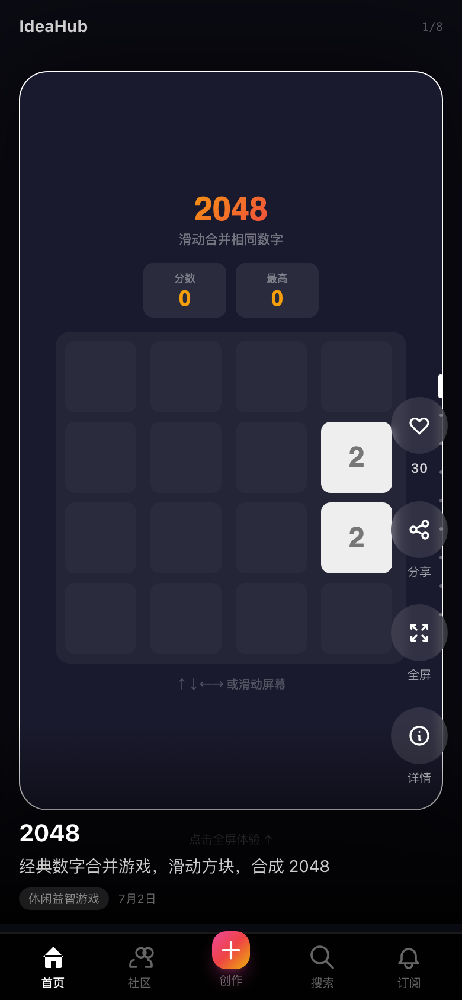
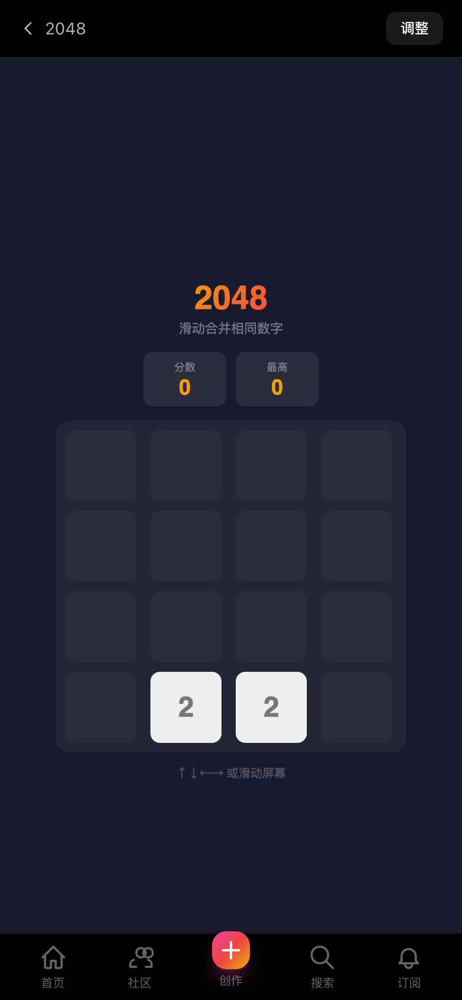
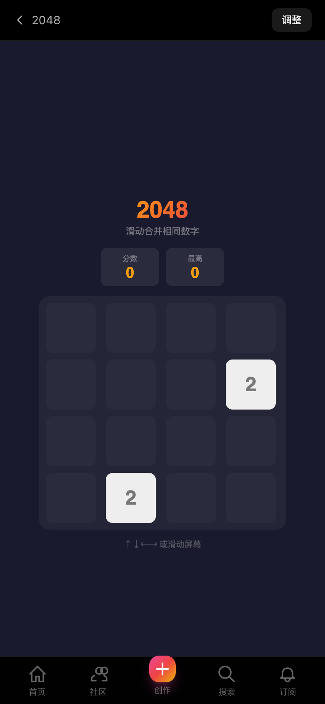

# IdeaHub · 刷游戏的 TikTok

> 输入一句话，AI 生成小游戏。上下滑动浏览，全屏试玩，社区投票。

🔗 **线上**: https://ideahub-pearl.vercel.app

## ✨ 核心特性

- **🎯 一键创建游戏** — 输入想法，AI 自动分析→设计→生成可玩小游戏（约 60 秒）
- **📱 TikTok 式滑动浏览** — 全屏卡片，上下滑动切换游戏，沉浸式体验
- **🎮 即开即玩** — 每个游戏都是自包含 HTML，点击即玩，无需下载
- **🔄 版本管理** — 不满意？描述调整需求，AI 生成新版本
- **🏆 社区排行** — 投票支持喜欢的游戏，排行榜实时更新
- **💬 Brainstorm 协作** — 发起讨论，收集需求，AI 重新生成产品
- **📰 订阅推送** — 订阅感兴趣的主题，每日邮件推送新作品

## 📱 页面预览

| 首页滑动 | 社区排行 | 创作游戏 |
|:---:|:---:|:---:|
|  |  |  |

| 游戏详情 | 全屏试玩 | 搜索 |
|:---:|:---:|:---:|
|  |  |  |

## 🎮 内置游戏

| 游戏 | 玩法 |
|---|---|
| 2048 | 经典数字合并，滑动合成 2048 |
| 画画板 | 自由绘画涂鸦，选色画笔 |
| 打砖块 | 控制挡板反弹小球消除砖块 |
| 俄罗斯方块 | 经典七种方块，消除整行 |
| 记忆翻牌 | 翻牌配对，考验记忆力 |
| 贪吃蛇 | 经典贪吃蛇，吃食物变长 |
| 数字猜谜 | 猜 1-100 数字，AI 给提示 |
| 彩色反应 | 测试反应速度，绿屏即点 |

## 🛠 技术栈

| 层级 | 技术 |
|---|---|
| 前端 | Next.js 14 + Tailwind CSS |
| AI | Agnes AI (agnes-1.5-flash) — 需求分析 + HTML 生成 |
| 存储 | jsonblob.com (远程) + localStorage (本地) |
| 部署 | Vercel (Serverless) |
| 搜索 | DuckDuckGo API |

## 🚀 本地开发

```bash
git clone https://github.com/vvlife/ideahub.git
cd ideahub
npm install

# 配置环境变量
echo "AGNES_API_KEY=your_key_here" > .env.local
echo "JSONBLOB_ID=your_blob_id" >> .env.local

# 填充演示数据
node scripts/seed-games.mjs

# 启动
npm run dev
```

## 📂 项目结构

```
ideahub/
├── app/
│   ├── page.tsx                  # 首页 - TikTok 滑动流
│   ├── create/page.tsx           # 创作页 - AI 一键生成
│   ├── community/page.tsx        # 社区排行
│   ├── product/[id]/             # 产品详情
│   ├── product/[id]/app/         # 全屏试玩
│   ├── search/page.tsx           # 搜索
│   ├── subscribe/page.tsx        # 订阅
│   └── api/
│       ├── create/route.ts       # AI 生成游戏 API
│       ├── community/route.ts    # 社区列表 API
│       ├── products/[id]/        # 产品 CRUD
│       └── p/[productId]/        # HTML 托管
├── components/
│   ├── swipe/                    # TikTok 滑动组件
│   │   ├── SwipeFeed.tsx
│   │   └── AppCard.tsx
│   └── layout.tsx                # 底部导航栏
├── lib/
│   ├── remote-store.ts           # 远程存储层
│   └── types.ts                  # 类型定义
└── scripts/
    └── seed-games.mjs            # 游戏种子数据
```

## 📄 License

MIT
